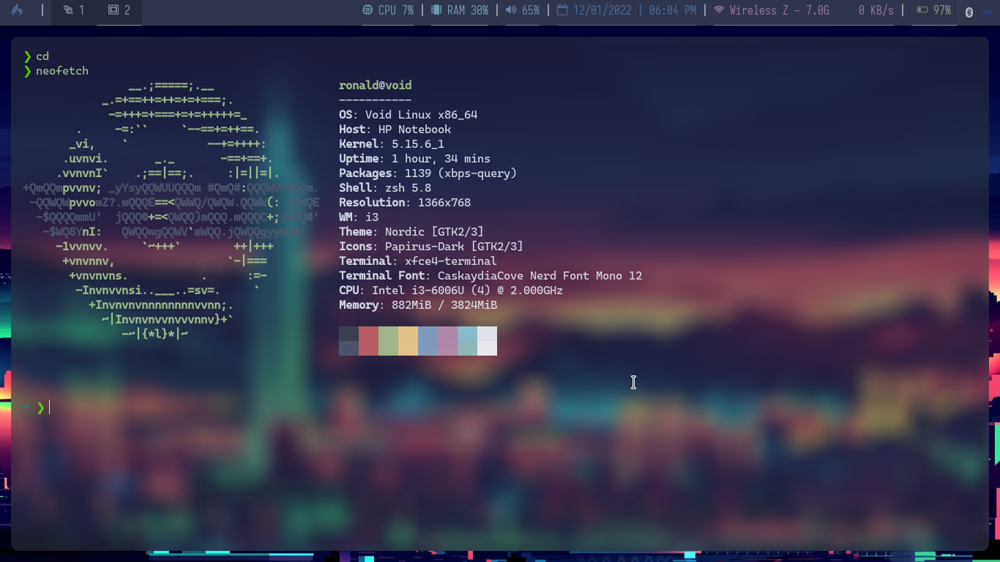
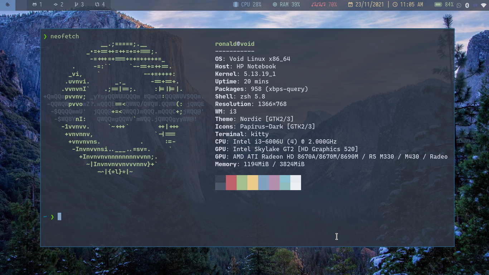
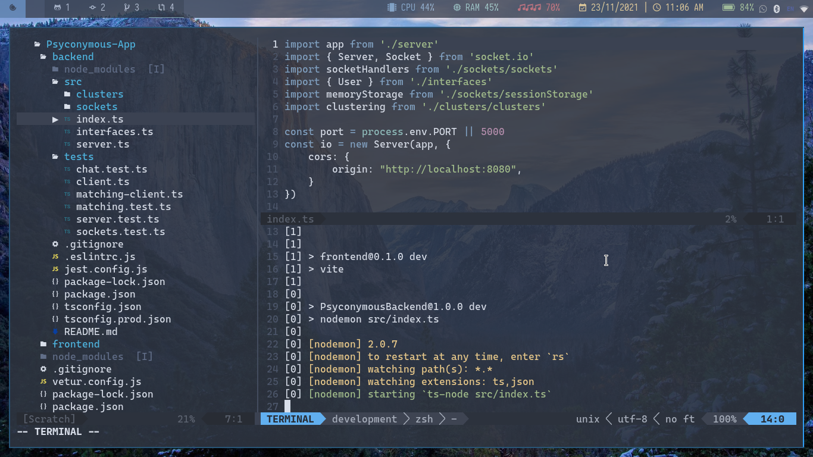

# Linux Dotfiles for Ronald

## Installation guide
refer to [guide](./INSTALL.md)

## Screenshots

### Wallpapers

## Environment
- i3-gaps
- polybar
- rofi
- picom ([with animations](https://github.com/jonaburg/picom))

## Fonts
- CaskaydiaCove Nerd Font Mono
- JetBrainsMono Nerd Font Mono Extra Bold
- SpaceMono Nerd Font Mono Italic Bold
- Iosevka

## Language Inputs
- ibus libpinyin

## Apps Used
- Caprine
- Whatsdesk
- Zoom
- Telegram 
- Discord

- Chromium
- Thunar
- Ranger
- LibreOffice
- Kitty
- Zathura

## GTK Theme
Nordic

## Misc
- maim and xclip to produce screenshots that are saved in the clipboard
- xbacklight for brightness control
- nitrogen to set background 
