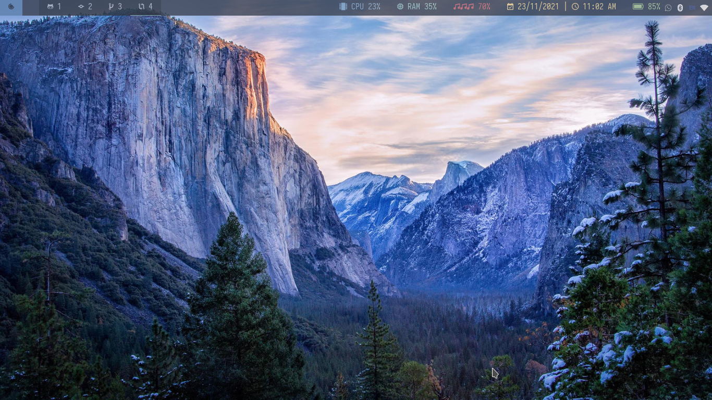
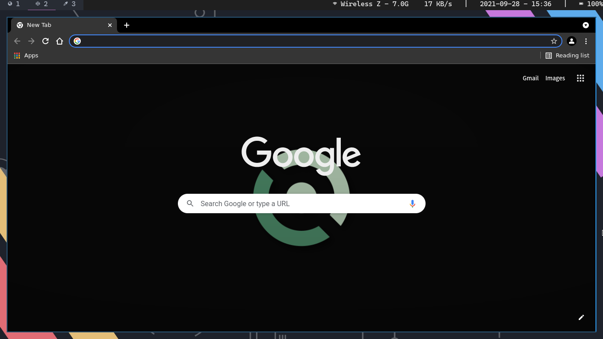
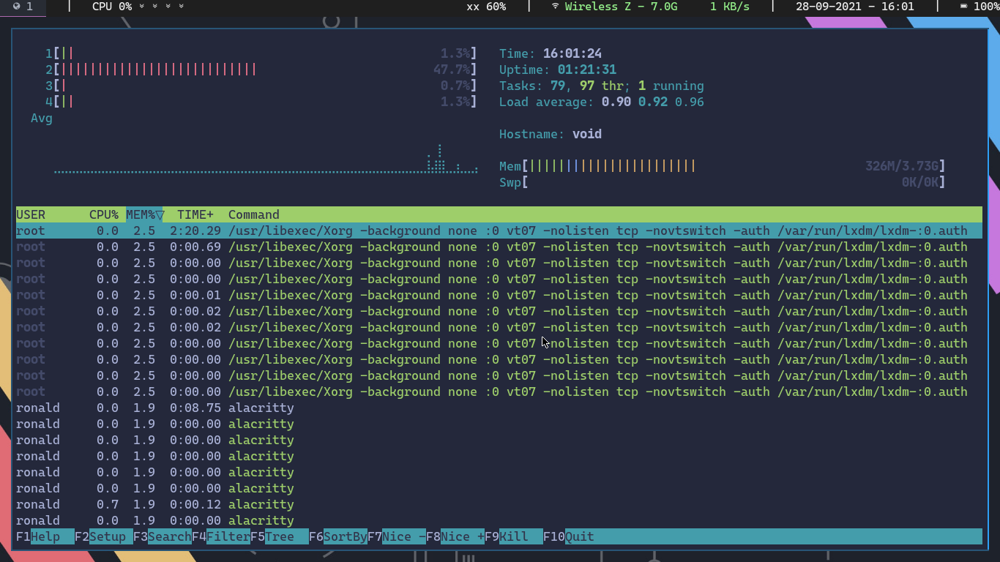
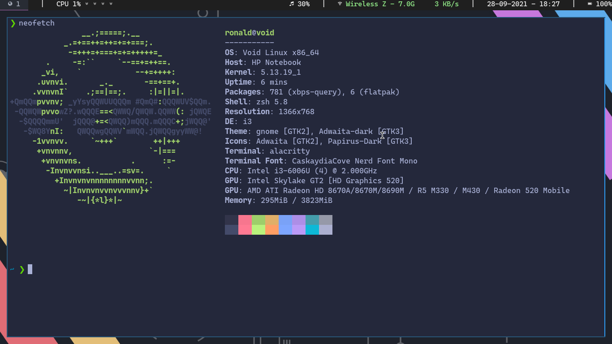

# Linux Dotfiles for Ronald

## Screenshots





### Wallpaper


## Environment
- i3-gaps
- polybar
- rofi

## Fonts
- CaskaydiaCove Nerd Font Mono
- JetBrainsMono Nerd Font Mono Extra Bold
- SpaceMono Nerd Font Mono Italic Bold

## Language Inputs
- ibus libpinyin

put this code block into .profile to use ibus inputs
``` sh
export GTK_IM_MODULE=ibus
export QT4_IM_MODULE=ibus
export QT_IM_MODULE=ibus
export XMODIFIERS=@im=ibus
```

## Apps Used
- Caprine
- Whatsdesk
- Zoom
- Telegram 
- Discord

- Chromium
- Thunar
- LibreOffice

## GTK Theme
Adwaita Dark

## Misc
- maim and xclip to produce screenshots that are saved in the clipboard
- xbacklight for brightness control
- nitrogen to set background 
